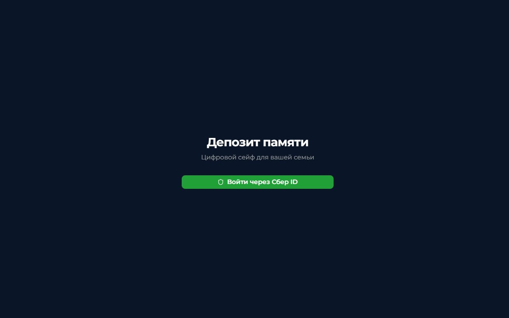
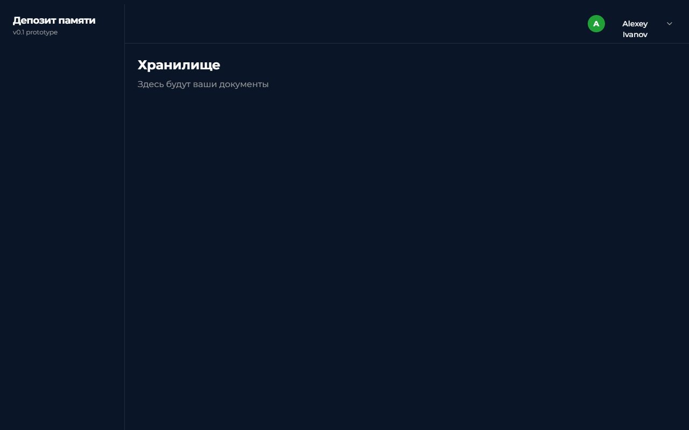
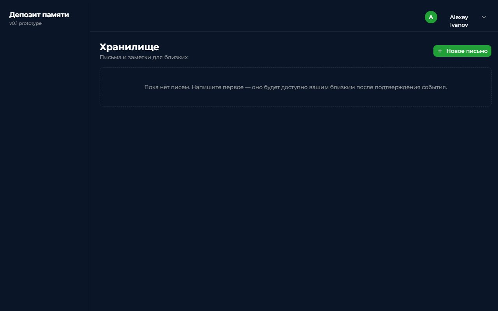
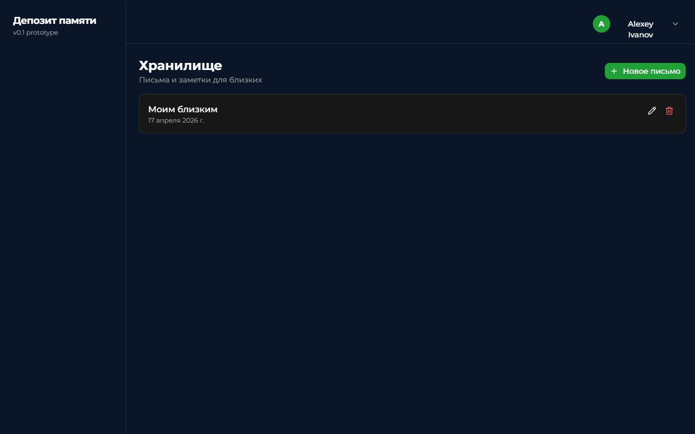
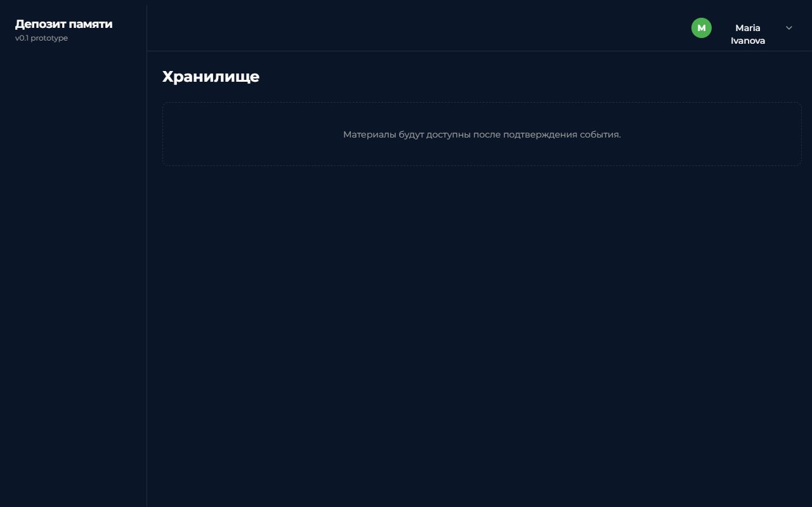

# Эволюция продукта «Депозит памяти»

Лог по ходу разработки: этапы продукта со скринами и подписями, ключевые промпты,
которые дали качественный скачок, и рефлексия на середине пути.

---

## Часть 1. Эволюция продукта

### Этап 1 — Каркас и аутентификация (Шаги 1–4)

Первый осязаемый продукт: проект на Next.js App Router + Tailwind + shadcn, схема Postgres
с RLS на всех таблицах, демо-аутентификация через фейковый «Сбер ID» и переключатель
ролей Алексей/Мария. Данных в приложении ещё нет — только каркас и вход.

#### Скрин 1.1. Вход через Сбер ID

Единственная кнопка на стартовой странице — «Войти через Сбер ID», без полей логина и
пароля, без второстепенных CTA. Сознательно минималистичная композиция: на питче зритель
должен за одну секунду понять, что это Сбер-продукт (зелёный цвет #21A038) и семейный
сейф («Цифровой сейф для вашей семьи»), а не тратить внимание на форму входа.

#### Скрин 1.2. Пустое хранилище после логина

Так выглядел `/vault` после Шагов 3–4, но до Шага 5: сайдбар, хедер с ролевым переключателем
(активен Алексей), заголовок «Хранилище» и заглушка «Здесь будут ваши документы». На этом
этапе у пользователя уже есть авторизованная сессия и возможность переключиться на Марию,
но БД пуста — это и есть точка, от которой поехала работа над письмами.

#### Что и почему

- **Tailwind v4 + shadcn выбран сразу**, чтобы за счёт готовых компонентов и `oklch`-палитры
  не тратить время на подбор цветов и примитивов; у прототипа задача — чистая картинка
  за неделю, не дизайнерская работа.
- **RLS включён с первой миграции**, а не «потом прикрутим»: на питче CISO первым спросит
  про изоляцию данных, а миграция политик задним числом рискованна (SECURITY DEFINER
  функции и перекрёстные зависимости между `vault_items` и `access_rules` легко сломать).
- **Fake-SberID через `signInWithPassword`** вместо реального OAuth: у прототипа нет
  бюджета на интеграцию, а демо-сценарий без логина не работает.

---

### Этап 2 — Хранилище писем (Шаг 5)

**Что изменилось:** Алексей теперь создаёт, редактирует и удаляет текстовые письма на
`/vault`. Мария на том же роуте видит только заглушку, пока по `trigger` не придёт событие
со статусом `delivered` — это первый раз, когда RLS работает не «в теории», а визуально
отличает роли на UI.

#### Скрин 2.1. Пустое хранилище Алексея (после Шага 5)

Переход от абстрактной заглушки «Здесь будут ваши документы» к осмысленному пустому
состоянию: заголовок, подзаголовок «Письма и заметки для близких» и единственная CTA
«+ Новое письмо». Выбрано именно это вместо полноэкранной формы — для пятиминутного питча
важен чистый первый экран, чтобы зритель сразу понял, что это именно сейф, а не редактор.

#### Скрин 2.2. Список писем после создания

Письмо появляется в списке сразу после сохранения — без перезагрузки страницы, за счёт
оптимистического обновления локального стейта от ответа Supabase. Это критично для
демо: пауза в секунду-две между «Сохранить» и появлением записи ломает ритм рассказа.
Кнопки «Редактировать / Удалить» вынесены на карточку, чтобы не плодить экраны.

#### Скрин 2.3. Вид Марии — заглушка, несмотря на существующее письмо

Переключение роли через dropdown справа сверху. Письмо Алексея физически существует в
`vault_items`, но политика RLS `vault_items_select` пускает получателя только если есть
связанный `trigger` со статусом `delivered`. Это не фронтовое сокрытие, а серверный
запрет — и именно это нужно будет показать CISO на питче: демонстрация zero-trust на
уровне БД, а не на уровне UI.

#### Что и почему

- **Убрана «общая» колонка `name` в пользу пары `title + content`.** Письмо — это не файл,
  а заголовок + текст; хранить их отдельно проще для рендера и будущего поиска.
  Миграция `0004_update_vault.sql` сделала `name` и `encrypted_blob_path` nullable
  (они ещё пригодятся для видео на Шаге 9) и расширила check-констрейнт типом `'note'`.
- **Тип `'document'` → `'note' | 'video'`.** Документы-блобы в прототипе отложены:
  цикл Web Crypto на 20 МБ подвешивает UI на 5–7 секунд и ломает питч. Заметки быстрее
  демонстрируют сам принцип хранилища.
- **RLS проверена вживую, а не «на доверии».** Под JWT Алексея и под JWT Марии прогнан
  прямой SELECT в Supabase — подтверждено, что Мария не видит чужих заметок. Это нужно,
  потому что на питче CISO первым делом спросит: «А если оба авторизованы одновременно?».

---

### Этап 3 — Видеообращение (Шаг 6)

**Что изменилось:** Алексей записывает 30-секундное видеообращение прямо в браузере через
`MediaRecorder`, оно сохраняется в приватный bucket `videos` и появляется в `/vault`
отдельной секцией — над списком писем, с кнопками «Перезаписать» и «Удалить». Одно
видео на пользователя (не коллекция). У Марии секция пока скрыта — откроется на
Шаге 9 (симуляция события) по тому же механизму RLS, что и письма.

#### Скрин 3.1. Запись с live-preview

Живое превью с камеры, таймер обратного отсчёта `0:30` и красная точка `REC` в
углах диалога. Автостоп именно на 30 секунд выбран не случайно: на питче видео
смотрят ровно один раз, и минутный клип ломает ритм рассказа. Плюс — 30 сек в
webm это ~5–8 MB, что укладывается в 20 MB лимит bucket'а с запасом даже на mp4
fallback в Safari.

#### Скрин 3.2. Превью перед сохранением

После «Остановить» Алексей видит записанный клип в `<video controls>` и три
чёткие кнопки: «Сохранить» (сберовский зелёный), «Перезаписать», «Отмена».
Намеренно три отдельные кнопки вместо stepped-wizard: на демо нельзя позволить
зрителю гадать, где «дальше». Превью показывается из локального
`URL.createObjectURL(blob)` — ещё до любого upload'а, чтобы пользователь
принял решение до сетевой задержки.

#### Скрин 3.3. Сохранённое видео в хранилище

После «Сохранить» видео поднимается в bucket `videos/{user_id}/main.webm`, в
`vault_items` появляется (или перезаписывается) строка `type='video'`, сервер
возвращает signed URL на час, и секция «Видеообращение» рендерится с `<video
controls>`. Ниже — независимая секция «Письма и заметки». Две секции, а не
смешанный список: видео — один артефакт, письма — коллекция, разные ментальные
модели.

#### Что и почему

- **Видео не шифруется в прототипе.** Архитектурно оно идентично документам
  (Web Crypto AES-GCM + PBKDF2, ключ из мастер-пароля), но прогон 20 MB через
  `crypto.subtle.encrypt` в браузере — это 5–7 секунд фриза UI. На питче такая
  пауза между «Сохранить» и следующим действием сломает ритм сильнее, чем
  отсутствие шифра сломает формальный аудит. Решение зафиксировано в
  `CLAUDE.md` — на вопрос CISO готов ответ «архитектурно то же, отложено по
  перформансу».
- **Отдельный bucket `videos` вместо единого `vault`.** Разные лимиты на
  файл (20 MB vs 50 MB), разные правила ретеншна в будущем, проще отзывать
  доступ по типу контента. Владелец определяется по первой папке имени
  объекта (`{user_id}/main.webm`); storage-политики `videos_storage_*`
  симметричны RLS на таблицах и используют ту же проверку
  `(storage.foldername(name))[1] = auth.uid()::text`.
- **Одно видео на пользователя, не коллекция.** API-route upsert'ит одну
  строку `vault_items` типа `video`, UI показывает одно превью. В демо важно
  «записал → сохранил → близкий увидел», а не UX контент-редактора.
- **Stream биндится к `<video>` через `useEffect`, а не инлайн.** Первый
  подход — присвоить `liveVideoRef.current.srcObject = stream` сразу после
  `getUserMedia` — не работает: `<video>` монтируется только при
  `state === "recording"`, а stream мы получаем в `state === "requesting"`,
  когда ref ещё `null`. Эффект на `state` привязывает `srcObject` ровно после
  того, как элемент появился в DOM. Баг поймали только на реальном тесте в
  prod — headless-preview с `getUserMedia` не проверить.
- **Dev-only fallback-кнопка на `/fallback-video.webm`.** Если на ноутбуке
  демонстратора откажет камера (или кто-то зажмёт попап с разрешением),
  кнопка в dev-режиме грузит заранее записанный клип из `public/` и
  проходит через тот же upload. Нужен именно для питча — в prod bundle
  кнопки нет.

---

### Этап 4 — Получатели (Шаг 7)

**Что изменилось:** у Алексея появился раздел `/recipients` с полноценным CRUD:
добавить / отредактировать / удалить близкого. Форма — диалог с
`react-hook-form + zod` (ФИО 2–100 символов, отношение из восьми значений —
жена / муж / сын / дочь / брат / сестра / родитель / другое). В сайдбар
добавился пункт «Получатели» с иконкой `Users`. У Марии тот же роут
отдаёт заглушку «доступен только владельцу» — гейт по
`user.id === DEMO_USERS.alexey.id`, без редиректа, чтобы на демо не
«улетать» с ожидаемой страницы. Seed-миграция `0005_seed_recipient.sql`
добавляет Марию как получателя Алексея с зафиксированным UUID
`33333333-3333-…` — к нему будут цепляться `access_rules` на Шаге 8.

#### Что и почему

- **Мария — гейт заглушкой, не редиректом.** На питче
  при переключении роли важно видеть, что «у получателя этого раздела
  нет». Редирект на `/vault` создаст иллюзию, что SidebarNav сломан, и
  зритель потратит внимание на разбор этой иллюзии.
- **Фиксированный UUID recipient-записи в seed.** Шаг 8 будет создавать
  `access_rules (vault_item_id, recipient_id, delay_days)`. Если
  recipient-id плавающий, ссылаться на него из следующей миграции
  нельзя, а писать «возьмите последний id из таблицы» в миграции —
  плохой тон. UUID прописан в шапке файла комментарием, чтобы его
  было видно из `git grep`.
- **relation как `enum`-строка, не FK на справочник.** Справочник из
  восьми значений — оверинженеринг для прототипа; `z.enum` на клиенте
  даёт те же гарантии, что и FK, ценой нулевых миграций.
- **Не делаем** приглашения, email / SMS / телефон, аватары, access
  rules. Блок «Что НЕ делай» в промпте снова сработал: при CRUD-форме
  соблазн добавить телефон и email почти непреодолим, и без явного
  запрета Claude бы их добавил «для полноты».

#### Разбор — разрыв между `git push` и миграциями БД

Главный сюрприз Шага 7 вскрылся после пуша в `main`: на вопрос «задеплоено
ли на пром?» правильный ответ — «код да, миграция нет». В этом проекте нет
автоматизации, которая применяет `supabase/migrations/*.sql` при пуше:

- **Vercel** собирает Next.js и дёргает API-роуты, но SQL не исполняет —
  у него нет сервисного ключа к Postgres и нет повода его иметь.
- **GitHub Actions** отсутствуют (`.github/workflows/` пустая) — некому
  дернуть `supabase db push` на pre-merge или post-merge.
- **`supabase/config.toml`** в репо нет, локальный Supabase CLI к
  прод-проекту не прилинкован — `db push` просто так не запустится.
- **Supabase сам папку `supabase/migrations/` в GitHub не читает**.

То есть SQL-файлы в репо — это **исходники миграций**, а не сами миграции.
На Шагах 1–6 миграции катались через Supabase MCP (`apply_migration`) или
руками в SQL Editor, и этот шаг подсветил: нужно прописать в чек-лист
«код закоммитил → миграцию применил → проверил на проме». Иначе легко
отдать на демо фронт, который ссылается на ещё не существующую в БД
запись.

В прототипе оставляю ручное применение через MCP — настраивать CI/CD
под семь миграций не окупается. Но для себя отметил: в первом же
продакшен-проекте этот пайплайн надо закрыть до первого коммита, а не
ловить из-за «а миграция почему не накатилась?».

---

### Этап 4+ — заглушка на будущие шаги

Следующие стадии будут добавлены по ходу работы (правило «скрин в конце каждого шага»):

- **Шаг 8 — Правила доступа и триггеры.** Настройка задержки, типа события (ZAGS / dead-man switch).
- **Шаг 9 — Симуляция события.** `/simulate` → переключение `trigger.status` → Мария получает доступ к письмам и видео.

---

## Часть 2. Ключевые промпты

Из текущей сессии выбраны три промпта, которые дали заметный скачок.

### Промпт 1. Детальный спек Шага 5 (хранилище писем)

- **Задача.** За один заход (без уточняющих вопросов и доработок) собрать полноценную
  CRUD-страницу `/vault` для заметок — с миграцией БД, UI, валидацией и проверкой RLS.
- **Промпт (суть).** Структурированный запрос с фиксированными блоками:
  *Задача → Контекст → 1. Миграция → 2. UI для breadwinner → 3. UI для recipient →
  4. RLS-проверка → Что НЕ делай → Когда закончишь → Жди моего ОК*. Блок «Что НЕ делай»
  явно вычеркнул четыре соблазнительных бонуса: видеозапись, получателей, access rules,
  rich text editor.
- **Результат.** Фича собралась с первой итерации: миграция применена, UI работает,
  `npx tsc --noEmit` зелёный, RLS проверен под двумя JWT через Supabase MCP. Ноль
  уточняющих вопросов со стороны Claude.
- **Доработка.** Не понадобилась. Единственное, что пришлось сделать позже — скрины
  процесса для защиты, и это была отдельная задача, не связанная с кодом.
- **Разбор.** Сработала связка «детальный спек + явный запрет». Без блока «Что НЕ делай»
  Claude добавил бы как минимум хлебные крошки к получателям — а это Шаг 6, который я
  ещё не начал проектировать.

### Промпт 2. «сделай скрины и опиши промежуточный результат работы сохрани в tasks.md»

- **Задача.** Сделать артефакт для защиты: набор скринов + описание по каждому,
  сохранённый в файле. Готовой инструментовки в Claude Code для этого нет.
- **Промпт.** Одна строка: «сделай скрины и опиши промежуточный результат работы
  сохрани в tasks.md».
- **Результат.** Claude на ходу собрал пайплайн: попробовал `html2canvas` (упал на
  Tailwind v4 `oklch`), переключился на `modern-screenshot`, написал временный POST-роут
  `app/api/dev-shot/route.ts` для сохранения base64 в файл, прогнал сценарий через
  `preview_eval` и собрал восемь скринов. Параллельно тестировал сам сценарий (логин,
  создание, редактирование, удаление, переключение роли).
- **Доработка.** Промпт был прерван пользователем после сбора скринов (до записи
  `tasks.md`). Это нормально — пришлось отдельно уточнить формат отчёта. В итоге заменили
  `tasks.md` на `docs/evolution.md` с более строгой структурой.
- **Разбор.** Когда задача требует инструмента, которого нет, правильнее дать Claude
  свободу построить его на лету, чем ограничивать промпт «используй только встроенные
  инструменты». Отказ «не могу сохранить файл» был бы хуже, чем 10 минут на API-route —
  тем более что тот же route переиспользовался во второй раз, для скрина Этапа 1.

### Промпт 3. «нужно так задокументировать как на скрине, предложи сначала план»

- **Задача.** Привести документацию проекта в соответствие с рубрикой защиты
  (Раздел 3: Эволюция + Ключевые промпты + Рефлексия, с минимумом 3–4 этапов и
  3–5 промптов).
- **Промпт.** Две фотографии требований + короткая инструкция: «нужно так
  задокументировать как на скрине, предложи сначала план».
- **Результат.** Claude вошёл в plan-mode, задал 4 уточняющих вопроса через
  `AskUserQuestion` (этапы / промпты / структура файлов / рефлексия), собрал план
  в `.claude/plans/`, получил аппрув — и только после этого пошёл переписывать.
- **Доработка.** По ответам на вопросы план пересобран: решили слить Шаги 1–4 в один
  этап (вместо бэкфилла каждого), брать промпты только из текущей сессии, оставить
  единый файл, писать черновик рефлексии сразу.
- **Разбор.** Явное «предложи сначала план» + рубрика с цифрами (3–4, 3–5, 5–10) дали
  скелет, по которому план лёг сам. Без «сначала план» Claude побежал бы писать
  evolution.md по интуиции, и потом пришлось бы переделывать структуру под рубрику.

### Промпт 4. Детальный спек Шага 6 (видеообращение)

- **Задача.** За один заход собрать Шаг 6 целиком: клиентский компонент
  `VideoRecorder` на `MediaRecorder`, API-route с upload в Supabase Storage,
  секция `/vault` с превью и управлением, отдельный bucket + storage-политики,
  fallback-видео для демо, обработка ошибок камеры, dev-only fallback-кнопка.
- **Промпт (суть).** Длинный структурированный спек с блоками
  *Задача → Контекст → 1. Bucket и политики → 2. Компонент VideoRecorder →
  3. Секция /vault → 4. API-route → 5. Fallback-видео → 6. Мария скрыта →
  Что НЕ делай → Когда закончишь → Жди моего ОК*. В «Что НЕ делай» явно
  вычеркнуты шифрование видео, коллекция из нескольких видео, обрезка,
  мультирецепиент, конвертация кодеков. В граничных условиях — webm с
  mp4-fallback для Safari, одно видео на пользователя, HTTPS для `getUserMedia`.
- **Результат.** Код собрался с первой итерации: `VideoRecorder.tsx`,
  `api/vault/video/route.ts`, `components/vault/video-section.tsx`,
  обновлённый `app/(app)/vault/page.tsx`, обновлённый `supabase/README.md`
  с 4 storage-политиками. `tsc --noEmit` зелёный после чистки stale
  `.next/dev/types`. Bucket `videos` и политики применены через Supabase MCP
  одной миграцией.
- **Доработка.** Потребовались две после-коммитные итерации: (a) на первом
  ручном тесте живое превью было чёрным — баг «`srcObject` присваивается до
  `setState("recording")`, ref ещё `null`», починен переносом привязки в
  `useEffect` на `state`, 12 строк; (b) Vercel трижды подряд блокировал
  production-деплой без build-логов, причина — commit email в формате
  `{id}+{user}@users.noreply.github.com` не резолвился в GitHub-аккаунт,
  обошли пустым коммитом с `--author="njreyesc <…@gmail.com>"`.
- **Разбор.** Снова сработал блок «Что НЕ делай»: без него ушёл бы ещё час
  на шифрование и мультирецепиент. Что не покрылось промптом — верификация:
  headless-preview не умеет `getUserMedia`, реальную работу камеры можно
  проверить только на ноутбуке с подтверждённым разрешением. Правильнее
  было сразу заложить «после коммита — обязательный ручной прогон на prod»,
  а не считать деплой финальной точкой.

---

## Часть 3. Рефлексия (черновик, финализируется после Шага 9)

1. **Главное открытие** — насколько быстро идёт работа, когда каждый промпт оформлен
   в формате «Задача / Что сделай / Что НЕ делай / Когда закончишь». Блок «Что НЕ делай»
   сработал лучше всего: отрезал на корню три-четыре «полезных бонуса», которые увели бы
   прототип в сторону.
2. **Проще, чем ожидалось** — Supabase RLS. Написал политики, прогнал два SELECT под
   разными JWT через MCP, убедился, что под Марией не вылезает чужая заметка — и эта
   проверка даёт уверенность на весь проект, а не только на Шаг 5.
3. **Сложнее, чем ожидалось** — Vercel на Hobby-плане. `TEAM_ACCESS_REQUIRED` на
   коммиты от `noreply.github.com`, отсутствие env-переменных на preview-таргете,
   Deployment Protection, блокирующий сырые URL — эти три вещи сожрали около часа,
   не имея отношения к коду. На Шаге 6 всплыл четвёртый: Vercel блокирует
   production-деплой, если `git config user.email` в формате
   `{id}+{user}@users.noreply.github.com` не резолвится в подключённый к проекту
   GitHub-аккаунт. Подлость в том, что CLI возвращает `"status":"deploy_failed"`
   с пустым `message` и пустыми build logs — диагностика через сам `vercel`
   невозможна, настоящая причина видна только в Deployment UI
   («Deployment Blocked — commit email … could not be matched»). Обошли пустым
   коммитом с `--author="njreyesc <nnjnnreyescz6921@gmail.com>"` и обычным `git
   push`, но без доступа к UI это легко превратить ещё в час ретраев.
4. **Лучшая техника промпт-инжиниринга** — делить работу на маленькие шаги с явным
   «Жди моего ОК» в конце. Без этого Claude начинает угадывать, какая следующая фича
   нужна, и тратит контекст на то, что я всё равно переделаю.
5. **Вторая по эффективности техника** — CLAUDE.md с правилами «нельзя менять стек без
   спроса», «коммиты я делаю сам», «не оптимизируй на стороне». Это экономит кучу
   отмен и возвратов.
6. **Неожиданный результат** — `modern-screenshot` подхватил Tailwind v4 `oklch` там,
   где `html2canvas` падал. В итоге пайплайн для скринов получился переиспользуемым
   для следующих Шагов без переделок.
7. **Что сделал бы иначе с самого начала:** настраивал бы Vercel env-переменные и
   team-access до первого коммита, а не после второго красного деплоя. И снимал бы
   хотя бы один скрин после каждого шага, даже если визуально страница не изменилась —
   восстанавливать через `git checkout` работает, но хрупко (дважды пришлось
   восстанавливать и удалять тот же `app/api/dev-shot/route.ts`).
8. **Неочевидная дырка в пайплайне деплоя** — Vercel и Supabase живут параллельно,
   и `git push` в `main` катит только код. Файлы `supabase/migrations/*.sql` — это
   исходники, а не действие: без `supabase db push` / MCP / ручного SQL в UI они
   на проде не появятся. На Шаге 7 это всплыло в форме «код задеплоен, seed-строки
   нет, UI показывает пустой список вместо Марии». Для прототипа оставил ручное
   применение через Supabase MCP; для любого следующего продакшен-проекта ставлю
   себе правило закрывать этот разрыв до первого коммита — либо GitHub Action
   на `supabase db push` с service-key, либо чек-лист «код + миграция + скрин
   с прода», который физически не даёт забыть.
